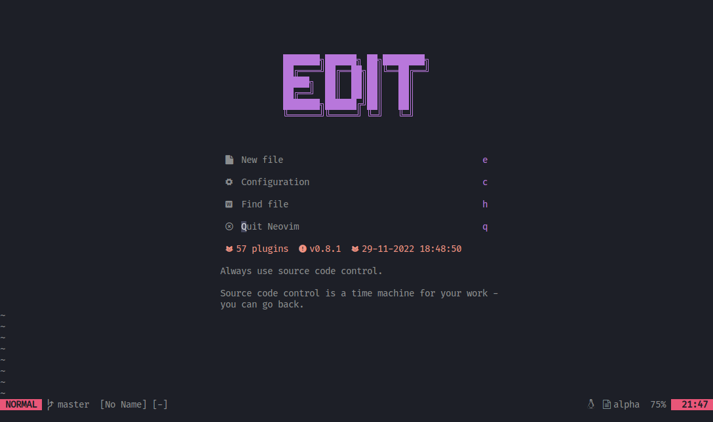
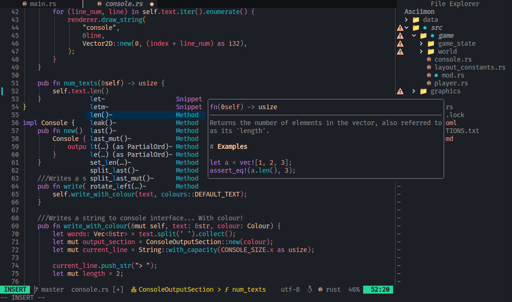

# Neovim config files

<h1 align="center">
  
</h1>

These my personal neovim config files.
I based them from the config files of @alpha2phi and @mathletedev.

## Flex 💪


 

___Theme___:  [Horizon](https://github.com/korigamik/horizon.nvim/) which I modified ;)

## Installation

You can test my config files by cloning this repository and sourcing
the `install.sh` script and running the `mnvim` command.

```bash
git clone $REPO_URL
cd .config/nvim
source ./install.sh
mnvim
```
